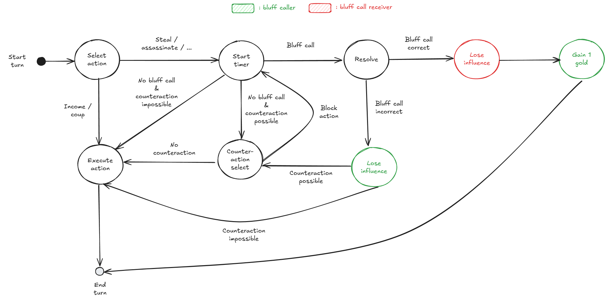

# Coup Backend

A Rust/Actix-web backend for the Coup card game with WebSocket support.

## Development

```bash
cargo run
```

## Environment Variables

| Variable | Description | Default |
|----------|-------------|---------|
| `HOST` | IP address to bind to | `127.0.0.1` |
| `PORT` | Port to listen on | `8080` |
| `CORS_ORIGINS` | Comma-separated list of allowed origins | `http://localhost:5173` |

### Example

```bash
HOST=0.0.0.0 PORT=8081 CORS_ORIGINS="https://coup.example.com,http://localhost:5173" cargo run
```

## Production Build

```bash
cargo build --release
./target/release/coup-backend
```

### Example systemd service

```ini
[Unit]
Description=Coup Game Backend
After=network.target

[Service]
Type=simple
User=www-data
Environment=HOST=0.0.0.0
Environment=PORT=8081
Environment=CORS_ORIGINS=https://coup.example.com
ExecStart=/path/to/coup-backend
Restart=on-failure

[Install]
WantedBy=multi-user.target
```

## Turn State Machine


